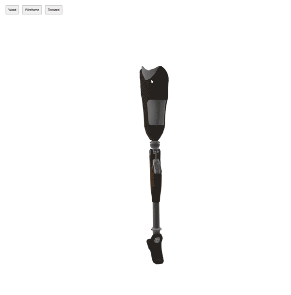
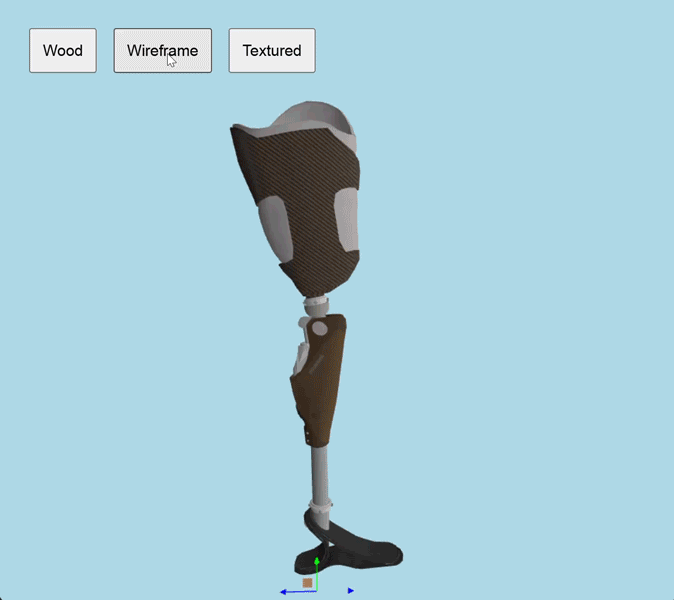

# ThreeJS-Demo
## First project using three js framework. 

I started this project as a first step to learn three js.
I followed the tutorial from [here](https://threejs.org/docs/index.html#manual/en/introduction/Creating-a-scene).
The code is available in the `index.html` file.
You can run the project by opening the `index.html` file in a web browser.

The result should look like this:

I created a procedural shader using glsl and applied it to the geometry.
A crash course on glsl can be found on this guy's github, he is the real deal: [Nik Lever](https://github.com/NikLever).

I kept working on this project and added more features, like controlling the model using and Add-on called CCDIK, which is a simple inverse kinematics solver for three.js.
You can check the CCDIK Add-on [here](https://threejs.org/docs/?q=solver#examples/en/animations/CCDIKSolver). 

The project is still a work in progress, but I will keep updating it with new features and improvements.

This is the current state of the project:

I hope you find this project useful!