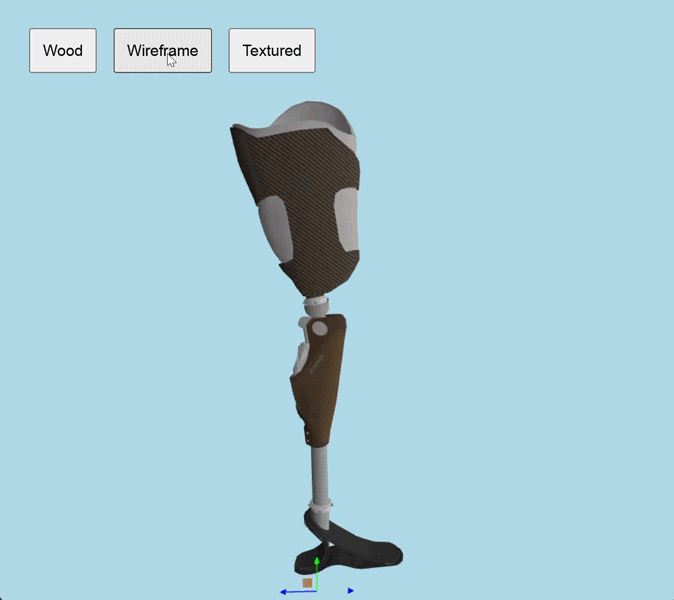
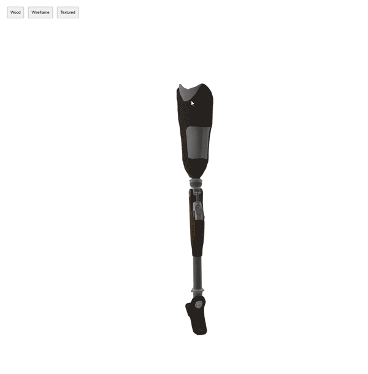

# Three.js Exploration: Shaders & Inverse Kinematics

A deep dive into 3D web graphics, transitioning from basic scene setup to custom **GLSL shaders** and **Inverse Kinematics (IK)**.

## Overview

This project began as a foundational step into the Three.js ecosystem. It has evolved from a simple "Hello Cube" demo into a playground for procedural textures and skeletal animation.

---

### Key Features

- **Procedural GLSL Shaders**: Custom fragment and vertex shaders for dynamic material effects.
- **Inverse Kinematics (IK)**: Implementation of the `CCDIKSolver` to handle realistric bone movement and limb constraints.
- **Performance-First**: Clean implementation within a single-entry `index.html` for rapid prototyping.

---

### Tech Stack

- **Engine**: [Three.js](https://threejs.org/)
- **Shading**: GLSL (OpenGl Shading Language)
- **Animation**: CCDIK (Cyclic Coordinate Descent Inverse Kinematics)

---

### Progress Gallery

**Phase 1**: The Beginning
My first step was mastering the Three.js lifecycle: Scene, Camera and Renderer.

**Phase 2**: Shaders & IK Integration
Currently, I'm focusing on procedural generation and character rigging. The gif below demonstrates the **CCDIKSolver** in action, allowing for fluid, programmatic model control.
You can check the CCDIK Add-on [here](https://threejs.org/docs/?q=solver#examples/en/animations/CCDIKSolver). 



---

### What I learned

- **The Graphics Pipeline**: Understanding how data passes from CPU to GPU via Uniforms and Attributes.
- **Math in Motion**: Implementing Inverse Kinematics taught me the importance of coordinate spaces (Local vs. World).
- **Resources**: Huge shoutout to [Nik Lever](https://github.com/NikLever) for the GLSL insights and the official [Three.js Documentation](https://threejs.org/docs/).

---

### How to Run
1. Clone the repo:
```
# Bash
git clone git@github.com:erwkuvi/ThreeJS-Demo.git
```
2. **Launch**: Simply open index.html in any modern web browser. (Note: Using a local server loke Live Server in VS Code is recommended to avoid CORS issues with textures/models).

I created a procedural shader using glsl and applied it to the geometry.
A crash course on glsl can be found on this guy's github, he is the real deal: [Nik Lever](https://github.com/NikLever).



---

### Roadmap

- [] Add dat.GUI for real-time shader parameter tuning.
- [] Implement post-processing effects (Bloom/DOF).
- [] Refactor into a modular ES6 class structure.


